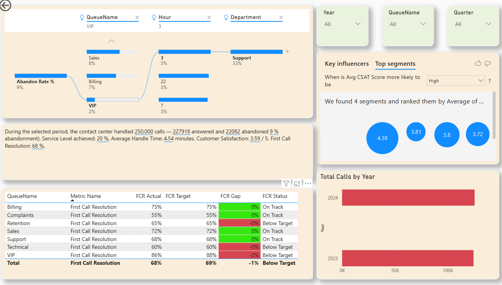

# 📊 Call Center Analytics Dashboard

**Executive Business Intelligence Reporting for Contact Center Operations**

A full-scope Power BI solution analyzing contact center performance across operations, workforce management, agent performance, customer experience, and forecasting — built on a star-schema data model with 69 DAX measures across 10 tables.



---

## 📌 Project Overview

This dashboard was built as an end-to-end BI solution simulating a real contact center environment: from raw call-log and scheduling data, through ETL and data modeling, to a 9-page executive reporting suite.

| Metric | Value |
|---|---|
| Total Calls Modeled | 250,000+ |
| Agents | 500 |
| Queues | 7 |
| DAX Measures | 69 |
| Report Pages | 9 |
| Data Period | Jan 2023 – Dec 2024 |

> **Data source note:** this project uses synthetic/simulated contact center data generated for portfolio purposes — it does not represent real client or company data.

---

## 🗂 Report Pages

1. **Project Overview** — landing page, scope and navigation
2. **Executive Summary** — total calls, service level, FCR, CSAT at a glance
3. **Workforce Management** — adherence, shrinkage, scheduled vs. actual hours
4. **Agent Performance** — per-agent AHT, FCR, CSAT and ranking
5. **Customer Experience** — CSAT distribution, FCR outcomes by queue
6. **Operations** — hourly call volume trend and peak-time heatmap
7. **Forecast vs. Actual** — forecast accuracy and monthly variance
8. **Queue Analysis** — SLA targets, abandon rate and status by queue
9. **Executive Insights** — decomposition tree and AI-powered key influencers

Full-resolution screenshots of every page are in [`/screenshots`](./screenshots).

---

## 🧮 Data Model

**Star schema** with one fact table and multiple dimension/supporting tables:

- `FactCalls` — call-level transactional data (AHT, ASA, FCR, CSAT, hold/talk/wrap time)
- `DimAgent`, `DimDate`, `DimQueue` — dimension tables
- `Schedule_Table` — agent scheduling data (adherence, shrinkage, overtime)
- `Forecast` — forecasted vs. actual call volume
- `Targets` — SLA/KPI targets by queue

See [`/dax-measures/key-measures.md`](./dax-measures/key-measures.md) for the core DAX logic behind every KPI on the dashboard.

---

## 🛠 Tools & Techniques

- **Power BI Desktop** — data modeling, DAX, report design
- **Power Query** — ETL: cleaning, transformation, custom date table
- **DAX** — 69 measures covering KPIs, time intelligence, ranking, and dynamic labels
- **Star Schema Design** — single fact table with conformed dimensions
- **Power BI AI visuals** — Decomposition Tree, Key Influencers

---

## 🔍 Key Insights

- Service level was tracking well below the 85% target across most queues, driven primarily by Complaints and Technical queues.
- VIP queue achieved the highest CSAT score (4.37) and lowest abandon rate (2%), while Complaints scored lowest on both.
- Forecast accuracy averaged 93%, with the largest variance occurring in months with seasonal call spikes.

---

## 📂 Repository Structure

```
call-center-analytics-dashboard/
├── README.md
├── CallCenter_Project.pbix
├── /screenshots/              → full-resolution page exports
├── /dax-measures/
│   └── key-measures.md        → core DAX code, organized by report section
└── /docs/
    └── Call_Center_Dashboard_Portfolio.pdf
```

---

## 👨‍💻 Author

**Mohamed Sabri Al-Deip**
Data Analyst | Power BI Developer | SQL · DAX · Python

- 🔗 [LinkedIn](https://www.linkedin.com/in/mohamed-sabri-aldeip)
- 💻 [GitHub](https://github.com/mohamed-sabri-analyst)
- 📧 m_sabry91@hotmail.com
- 📍 Doha, Qatar — Open to Data Analyst / Power BI Developer roles
